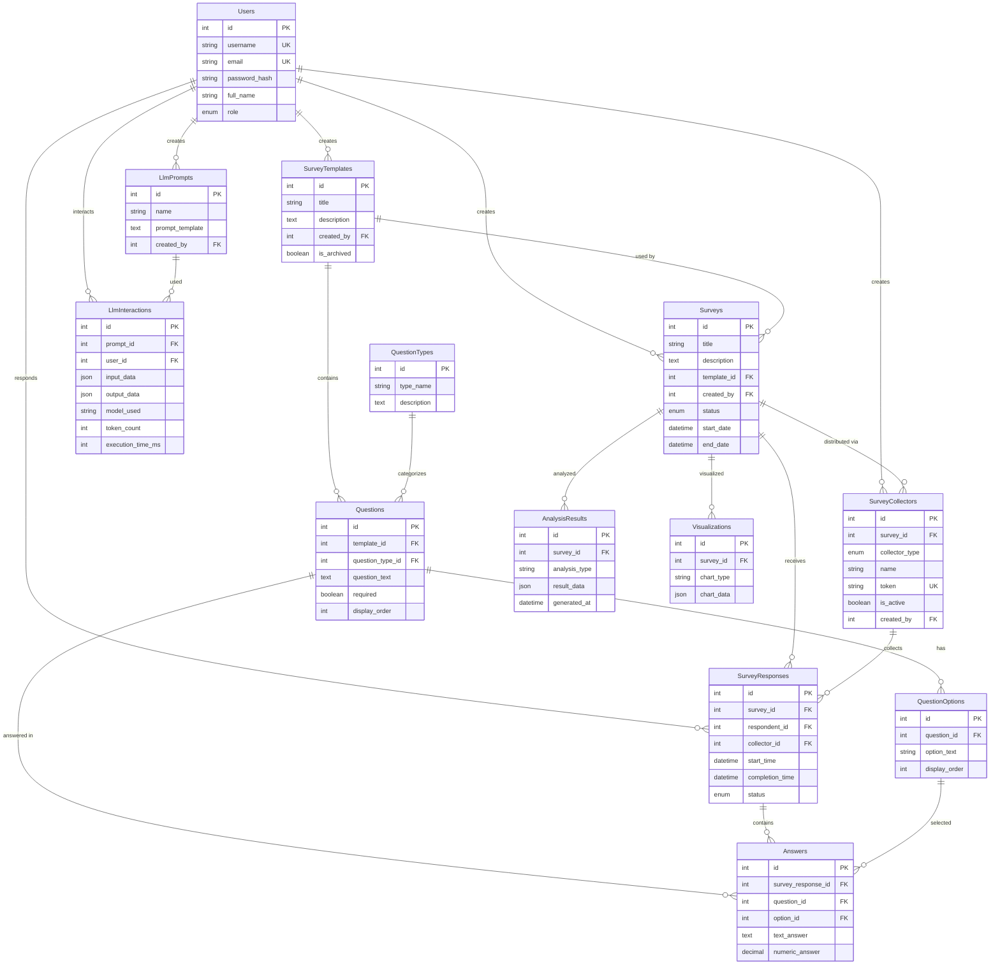

# Database Schema Map

## Models & Associations

**File**: `Backend/src/models/index.js`

---

## Core Tables

### 1. Users
**Model**: `User` (`user.model.js`)  
**Table**: `Users`

**Columns**:
```
id (PK)
username (unique)
email (unique)
password_hash
full_name
role (enum: 'admin', 'creator', 'student')
created_at
updated_at
```

**Relationships**:
- **Has Many**: SurveyTemplate (created_by)
- **Has Many**: Survey (created_by)
- **Has Many**: SurveyResponse (respondent_id)
- **Has Many**: SurveyCollector (created_by)
- **Has Many**: LlmPrompt (created_by)
- **Has Many**: LlmInteraction (user_id)

---

### 2. SurveyTemplates
**Model**: `SurveyTemplate` (`surveyTemplate.model.js`)  
**Table**: `SurveyTemplates`

**Columns**:
```
id (PK)
title
description
created_by (FK → Users.id)
is_archived (default: 0)
created_at
updated_at
```

**Relationships**:
- **Belongs To**: User (created_by)
- **Has Many**: Question (template_id) as 'Questions'
- **Has Many**: Survey (template_id) as 'surveys'

**Indexes**:
- `created_by` (FK index)

---

### 3. QuestionTypes
**Model**: `QuestionType` (`questionType.model.js`)  
**Table**: `QuestionTypes`

**Columns**:
```
id (PK)
type_name (enum: 'multiple_choice', 'checkbox', 'likert_scale', 'open_ended', 'dropdown')
description
created_at
updated_at
```

**Relationships**:
- **Has Many**: Question (question_type_id)

**Seeded Data**:
```
1: multiple_choice - "Single selection from options"
2: checkbox - "Multiple selections allowed"
3: likert_scale - "Rating scale (1-5)"
4: open_ended - "Free text response"
5: dropdown - "Dropdown selection"
```

---

### 4. Questions
**Model**: `Question` (`question.model.js`)  
**Table**: `Questions`

**Columns**:
```
id (PK)
template_id (FK → SurveyTemplates.id)
question_type_id (FK → QuestionTypes.id)
question_text
required (boolean, default: false)
display_order (default: 1)
created_at
updated_at
```

**Relationships**:
- **Belongs To**: SurveyTemplate (template_id)
- **Belongs To**: QuestionType (question_type_id) as 'QuestionType'
- **Has Many**: QuestionOption (question_id) as 'QuestionOptions'
- **Has Many**: Answer (question_id)

**Indexes**:
- `template_id` (FK index)
- `question_type_id` (FK index)
- `(template_id, display_order)` (ordering index)

---

### 5. QuestionOptions
**Model**: `QuestionOption` (`questionOption.model.js`)  
**Table**: `QuestionOptions`

**Columns**:
```
id (PK)
question_id (FK → Questions.id)
option_text
display_order (default: 1)
created_at
updated_at
```

**Relationships**:
- **Belongs To**: Question (question_id)
- **Has Many**: Answer (option_id)

**Indexes**:
- `question_id` (FK index)
- `(question_id, display_order)` (ordering index)

**Note**: Only used for multiple_choice, checkbox, dropdown question types

---

### 6. Surveys
**Model**: `Survey` (`survey.model.js`)  
**Table**: `Surveys`

**Columns**:
```
id (PK)
title
description
template_id (FK → SurveyTemplates.id)
created_by (FK → Users.id)
status (enum: 'draft', 'active', 'paused', 'closed', default: 'draft')
start_date
end_date
created_at
updated_at
```

**Relationships**:
- **Belongs To**: SurveyTemplate (template_id) as 'template'
- **Belongs To**: User (created_by) as 'creator'
- **Has Many**: SurveyCollector (survey_id) as 'Collectors'
- **Has Many**: SurveyResponse (survey_id)
- **Has Many**: AnalysisResult (survey_id)
- **Has Many**: Visualization (survey_id)

**Indexes**:
- `template_id` (FK index)
- `created_by` (FK index)
- `status` (filter index)

---

### 7. SurveyCollectors
**Model**: `SurveyCollector` (`surveyCollector.model.js`)  
**Table**: `SurveyCollectors`

**Columns**:
```
id (PK)
survey_id (FK → Surveys.id)
collector_type (enum: 'public_link', 'email', 'embed', default: 'public_link')
name
token (unique, 64 chars hex)
is_active (boolean, default: true)
created_by (FK → Users.id)
created_at
updated_at
```

**Relationships**:
- **Belongs To**: Survey (survey_id) as 'Survey'
- **Belongs To**: User (created_by)
- **Has Many**: SurveyResponse (collector_id)

**Indexes**:
- `survey_id` (FK index)
- `token` (unique index)
- `is_active` (filter index)

**Token Generation**: `crypto.randomBytes(32).toString('hex')`

---

### 8. SurveyResponses
**Model**: `SurveyResponse` (`surveyResponse.model.js`)  
**Table**: `SurveyResponses`

**Columns**:
```
id (PK)
survey_id (FK → Surveys.id)
respondent_id (FK → Users.id, nullable for anonymous)
collector_id (FK → SurveyCollectors.id, nullable)
start_time
completion_time
status (enum: 'in_progress', 'completed', 'abandoned', default: 'in_progress')
created_at
updated_at
```

**Relationships**:
- **Belongs To**: Survey (survey_id)
- **Belongs To**: User (respondent_id) - nullable for anonymous responses
- **Belongs To**: SurveyCollector (collector_id)
- **Has Many**: Answer (survey_response_id)

**Indexes**:
- `survey_id` (FK index)
- `respondent_id` (FK index, nullable)
- `collector_id` (FK index, nullable)
- `status` (filter index)
- `created_at` (ordering index)

**Anonymous Responses**: Use `respondent_id = 1` (default anonymous user)

---

### 9. Answers
**Model**: `Answer` (`answer.model.js`)  
**Table**: `Answers`

**Columns**:
```
id (PK)
survey_response_id (FK → SurveyResponses.id)
question_id (FK → Questions.id)
option_id (FK → QuestionOptions.id, nullable)
text_answer (nullable)
numeric_answer (nullable)
created_at
updated_at
```

**Relationships**:
- **Belongs To**: SurveyResponse (survey_response_id)
- **Belongs To**: Question (question_id)
- **Belongs To**: QuestionOption (option_id) - nullable

**Indexes**:
- `survey_response_id` (FK index)
- `question_id` (FK index)
- `option_id` (FK index, nullable)

**Storage Rules**:
- **Single choice**: Store option_id
- **Checkbox**: Create multiple Answer rows, each with option_id
- **Text answer**: Store text_answer
- **Numeric answer**: Store numeric_answer
- **One of (option_id, text_answer, numeric_answer)** must be non-null

---

## Auxiliary Tables

### 10. AnalysisResults
**Model**: `AnalysisResult` (`analysisResult.model.js`)  
**Table**: `AnalysisResults`

**Columns**:
```
id (PK)
survey_id (FK → Surveys.id)
analysis_type
result_data (JSON)
generated_at
created_at
updated_at
```

**Relationships**:
- **Belongs To**: Survey (survey_id)

---

### 11. Visualizations
**Model**: `Visualization` (`visualization.model.js`)  
**Table**: `Visualizations`

**Columns**:
```
id (PK)
survey_id (FK → Surveys.id)
chart_type
chart_data (JSON)
created_at
updated_at
```

**Relationships**:
- **Belongs To**: Survey (survey_id)

---

### 12. LlmPrompts
**Model**: `LlmPrompt` (`llmPrompt.model.js`)  
**Table**: `LlmPrompts`

**Columns**:
```
id (PK)
name
prompt_template
created_by (FK → Users.id)
created_at
updated_at
```

**Relationships**:
- **Belongs To**: User (created_by)
- **Has Many**: LlmInteraction (prompt_id)

---

### 13. LlmInteractions
**Model**: `LlmInteraction` (`llmInteraction.model.js`)  
**Table**: `LlmInteractions`

**Columns**:
```
id (PK)
prompt_id (FK → LlmPrompts.id)
user_id (FK → Users.id)
input_data (JSON)
output_data (JSON)
model_used
token_count
execution_time_ms
created_at
updated_at
```

**Relationships**:
- **Belongs To**: LlmPrompt (prompt_id)
- **Belongs To**: User (user_id)

---

## Entity Relationship Diagram



---

## Key Foreign Key Constraints

### CASCADE Deletes
- `Questions.template_id` → `SurveyTemplates.id` (ON DELETE CASCADE)
- `QuestionOptions.question_id` → `Questions.id` (ON DELETE CASCADE)
- `Answers.survey_response_id` → `SurveyResponses.id` (ON DELETE CASCADE)

### RESTRICT Deletes
- `Surveys.template_id` → `SurveyTemplates.id` (ON DELETE RESTRICT)
  - **Reason**: Prevents deleting templates used by surveys
  - **Check**: `template.service.js:149-195`
- `SurveyResponses.survey_id` → `Surveys.id` (ON DELETE RESTRICT)
  - **Reason**: Preserves response data

### SET NULL
- `SurveyResponses.respondent_id` → `Users.id` (ON DELETE SET NULL)
  - **Reason**: Anonymous responses allowed
- `SurveyResponses.collector_id` → `SurveyCollectors.id` (ON DELETE SET NULL)
  - **Reason**: Preserves responses if collector deleted

---

## Query Patterns

### Get Template with Questions
```javascript
SurveyTemplate.findByPk(id, {
  include: [{
    model: Question,
    as: 'Questions',
    include: [
      { model: QuestionType, as: 'QuestionType' },
      { model: QuestionOption, as: 'QuestionOptions' }
    ],
    order: [['display_order', 'ASC']]
  }]
})
```

### Get Survey Responses with Answers
```javascript
SurveyResponse.findAll({
  where: { survey_id },
  include: [{
    model: Answer,
    include: [
      { model: Question, include: [QuestionType] },
      { model: QuestionOption }
    ]
  }],
  order: [['created_at', 'DESC']]
})
```

### Get Public Survey by Token
```javascript
SurveyCollector.findOne({
  where: { token, is_active: true },
  include: [{
    model: Survey,
    include: [{
      model: SurveyTemplate,
      include: [{
        model: Question,
        include: [QuestionType, QuestionOption]
      }]
    }]
  }]
})
```

---

## Indexes Summary

**Critical Indexes**:
1. `Users.username` (UNIQUE)
2. `Users.email` (UNIQUE)
3. `SurveyCollectors.token` (UNIQUE)
4. `Questions.(template_id, display_order)` (COMPOSITE)
5. `QuestionOptions.(question_id, display_order)` (COMPOSITE)
6. `SurveyResponses.created_at` (ORDERING)
7. Foreign Key indexes on all FK columns

---

*Schema managed by Sequelize ORM with automatic migrations.*
