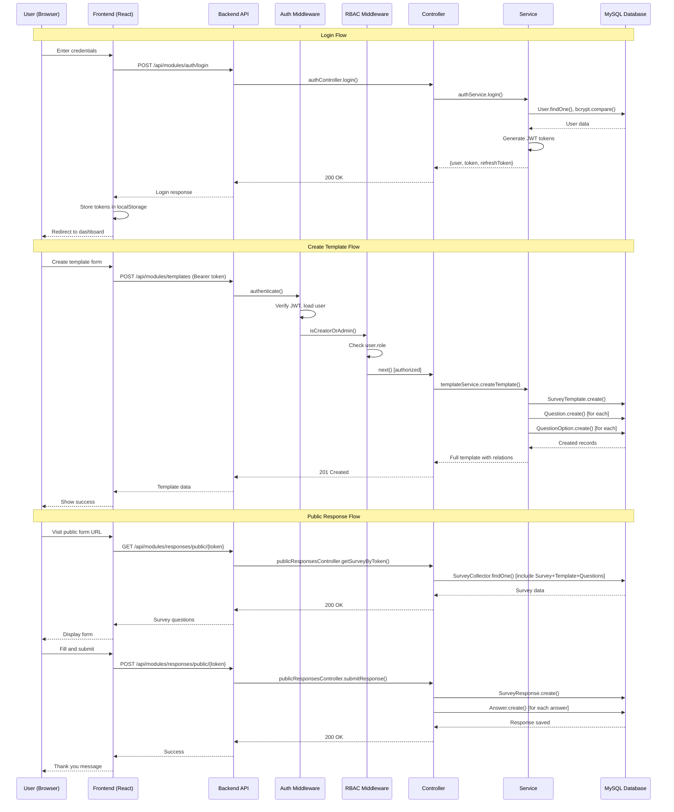

# Request Flows - End-to-End Tracing

This document traces every major request flow through the entire stack: UI → Service → Route → Controller → Service → Model → Database.

---

## A) Authentication Flow

### A1. Login Request

**Frontend Flow**:
```
LoginPage (src/pages/Auth/Login/index.jsx:80)
  → AuthService.login() (src/api/services/auth.service.js:26)
    → http.post('/auth/login', { email/username, password })
      → API_BASE_URL + '/auth/login'
      → http://localhost:5000/api/modules/auth/login
```

**Backend Flow**:
```
POST /api/modules/auth/login
  ↓
app.js:43 → router.use('/api/modules', moduleRoutes)
  ↓
modules.routes.js:8 → router.use('/auth', modules.authRbac.routes)
  ↓
auth.routes.js:19 → router.post('/login', authController.login)
  ↓
auth.controller.js:45 → authController.login(req, res)
  - Extracts: username/email + password
  - Validates: checks identifier and password exist
  ↓
auth.service.js:45 → authService.login(identifier, password)
  - Finds user by username OR email
  - Model: User.findOne({ where: { [Op.or]: [{ username }, { email }] } })
  - Compares password: bcrypt.compare(password, user.password_hash)
  - Generates tokens:
    * accessToken: jwt.sign({ id, username, role }, JWT_SECRET, { expiresIn: '1h' })
    * refreshToken: jwt.sign({ id }, JWT_SECRET, { expiresIn: '7d' })
  - Returns: { user, token, refreshToken }
  ↓
Response (200):
{
  "success": true,
  "message": "Login successful",
  "data": {
    "user": { "id": 1, "username": "admin", "role": "admin", "full_name": "..." },
    "token": "eyJhbGciOiJIUzI1NiIsInR5cCI6IkpXVCJ9...",
    "refreshToken": "eyJhbGciOiJIUzI1NiIsInR5cCI6IkpXVCJ9..."
  }
}
```

**Frontend Storage** (auth.service.js:38-42):
```javascript
localStorage.setItem('token', token);
localStorage.setItem('refreshToken', refreshToken);
localStorage.setItem('user', JSON.stringify(user));
setAuthToken(token);
```

---

### A2. Get Profile Request

**Frontend Flow**:
```
DashboardRouter (src/components/Dashboard/DashboardRouter.jsx:useEffect)
  → AuthService.getProfile() (src/api/services/auth.service.js:71)
    → http.get('/auth/profile')
      → Headers: { Authorization: 'Bearer <token>' }
```

**Backend Flow**:
```
GET /api/modules/auth/profile
  ↓
auth.routes.js:33 → router.get('/profile', authenticate, authController.getProfile)
  ↓
auth.js:8 → authenticate(req, res, next)
  - Extracts token from: req.headers.authorization.replace('Bearer ', '')
  - Verifies JWT: jwt.verify(token, JWT_SECRET)
  - Loads user: User.findByPk(decoded.id, { attributes: ['id', 'username', 'email', 'role', ...] })
  - Attaches: req.user = user
  - Calls: next()
  ↓
auth.controller.js:108 → authController.getProfile(req, res)
  ↓
auth.service.js:102 → authService.getProfile(req.user.id)
  - Queries: User.findByPk(userId, { 
      attributes: ['id', 'username', 'email', 'full_name', 'role', 'created_at'],
      raw: true 
    })
  ↓
Response (200):
{
  "success": true,
  "data": {
    "user": {
      "id": 1,
      "username": "admin",
      "email": "admin@example.com",
      "full_name": "Admin User",
      "role": "admin",
      "created_at": "2025-01-01T00:00:00.000Z"
    }
  }
}
```

**Alternative Endpoint**: `/api/modules/auth/me` (auth.routes.js:40) - same handler

---

## B) Template Management

### B1. Create Template

**Frontend Flow**:
```
TemplateEditor (src/pages/Templates/TemplateEditor/index.jsx:saveTemplate)
  → TemplateService.createTemplate(templateData) (src/api/services/template.service.js:26)
    → http.post('/templates', {
        title: "Customer Satisfaction",
        description: "...",
        questions: [...]
      })
```

**Backend Flow**:
```
POST /api/modules/templates
  ↓
template.routes.js:33 → router.post('/', authenticate, isCreatorOrAdmin, templateController.createTemplate)
  ↓
rbac.js:8 → isCreatorOrAdmin(req, res, next)
  - Checks: req.user.role === 'admin' || req.user.role === 'creator'
  - Returns 403 if not authorized
  ↓
template.controller.js:77 → templateController.createTemplate(req, res)
  - Validates: title is required
  - Extracts: { title, description, questions }
  ↓
template.service.js:76 → templateService.createTemplate(templateData, user)
  - Creates template: SurveyTemplate.create({ title, description, created_by: user.id })
  - For each question in questions array:
    * Creates: Question.create({
        template_id,
        question_type_id,
        question_text,
        required,
        display_order
      })
    * For each option in question.options:
      - Creates: QuestionOption.create({
          question_id,
          option_text,
          display_order
        })
  - Returns full template with relations: getTemplateById(template.id)
  ↓
Response (201):
{
  "success": true,
  "ok": true,
  "message": "Template created successfully",
  "id": 5,
  "data": {
    "template": {
      "id": 5,
      "title": "Customer Satisfaction",
      "description": "...",
      "created_by": 1,
      "Questions": [...]
    },
    "template_id": 5
  }
}
```

---

### B2. Add Question with Options

**Frontend Flow**:
```
TemplateEditor (src/pages/Templates/TemplateEditor/index.jsx:addQuestion)
  → TemplateService.addQuestion(templateId, questionData) (src/api/services/template.service.js:87)
    → http.post(`/templates/${templateId}/questions`, {
        question_type_id: 1,
        question_text: "What is your favorite color?",
        required: true,
        display_order: 1,
        options: [
          { option_text: "Red", display_order: 1 },
          { option_text: "Blue", display_order: 2 }
        ]
      })
```

**Backend Flow**:
```
POST /api/modules/templates/:id/questions
  ↓
template.routes.js:68 → router.post('/:id/questions', authenticate, isCreatorOrAdmin, templateController.addQuestion)
  ↓
template.controller.js:294 → templateController.addQuestion(req, res)
  - Extracts: templateId from params, questionData from body
  - Payload shape: {
      question_type_id: number,
      question_text: string,  // OR label: string (normalized)
      required: boolean,
      display_order: number,
      options: Array<{ option_text: string, display_order: number }>
    }
  ↓
template.service.js:335 → templateService.addQuestion(templateId, questionData, user)
  - Validates template exists: SurveyTemplate.findByPk(templateId)
  - Checks ownership: user.role === 'admin' || template.created_by === user.id
  - Creates question: Question.create({
      template_id,
      question_type_id,
      question_text: questionData.question_text || questionData.label,  // Accepts both
      required: questionData.required || false,
      display_order: questionData.display_order || 1
    })
  - For each option:
    * Supports string format: "Option A"
    * Supports object format: { option_text: "Option A", display_order: 1 }
    * Creates: QuestionOption.create({
        question_id,
        option_text,
        display_order
      })
  - Returns full template: getTemplateById(templateId)
  ↓
Database:
  - INSERT INTO Questions (template_id, question_type_id, question_text, required, display_order)
  - INSERT INTO QuestionOptions (question_id, option_text, display_order) [multiple rows]
  ↓
Response (200):
{
  "success": true,
  "message": "Question added successfully",
  "data": {
    "template": {
      "id": 5,
      "Questions": [
        {
          "id": 12,
          "question_text": "What is your favorite color?",
          "QuestionType": { "type_name": "multiple_choice" },
          "QuestionOptions": [
            { "id": 45, "option_text": "Red", "display_order": 1 },
            { "id": 46, "option_text": "Blue", "display_order": 2 }
          ]
        }
      ]
    }
  }
}
```

**Storage Confirmation**:
- `question_text` field in DB stores question label
- `question_type_id` links to QuestionType table (1=multiple_choice, 2=checkbox, etc.)
- `QuestionOptions` table has FK to `question_id`

---

### B3. Get Template with Questions and Options

**Frontend Flow**:
```
TemplateEditor (src/pages/Templates/TemplateEditor/index.jsx:fetchTemplateData)
  → TemplateService.getTemplateById(id) (src/api/services/template.service.js:52)
    → http.get(`/templates/${id}`)
```

**Backend Flow**:
```
GET /api/modules/templates/:id
  ↓
template.routes.js:26 → router.get('/:id', authenticate, templateController.getTemplateById)
  ↓
template.controller.js:35 → templateController.getTemplateById(req, res)
  ↓
template.service.js:48 → templateService.getTemplateById(templateId)
  - Queries: SurveyTemplate.findByPk(templateId, {
      include: [
        { model: User, attributes: ['id', 'username', 'full_name'] },
        {
          model: Question,
          as: 'Questions',
          include: [
            { model: QuestionType, as: 'QuestionType', attributes: ['id', 'type_name', 'description'] },
            { model: QuestionOption, as: 'QuestionOptions', attributes: ['id', 'option_text', 'display_order'] }
          ],
          order: [['display_order', 'ASC']]
        }
      ]
    })
  ↓
template.controller.js:47 → Normalizes questions format:
  - Maps question.question_text → label
  - Maps QuestionType.type_name → type
  - Maps QuestionOptions → options array
  ↓
Response (200):
{
  "success": true,
  "ok": true,
  "data": {
    "template": {
      "id": 5,
      "title": "Customer Satisfaction",
      "description": "...",
      "created_by": 1,
      "User": { "username": "creator1" },
      "Questions": [
        {
          "id": 12,
          "question_text": "What is your favorite color?",
          "required": true,
          "display_order": 1,
          "QuestionType": { "type_name": "multiple_choice" },
          "QuestionOptions": [
            { "id": 45, "option_text": "Red", "display_order": 1 },
            { "id": 46, "option_text": "Blue", "display_order": 2 }
          ]
        }
      ]
    },
    "template_id": 5,
    "title": "Customer Satisfaction"
  },
  "questions": [
    {
      "id": 12,
      "label": "What is your favorite color?",  // Normalized
      "type": "multiple_choice",                // Normalized
      "required": true,
      "display_order": 1,
      "options": [
        { "id": 45, "text": "Red", "display_order": 1 },
        { "id": 46, "text": "Blue", "display_order": 2 }
      ]
    }
  ]
}
```

---

## C) Survey Management

### C1. Create Survey from Template

**Frontend Flow**:
```
SurveyCreation (src/pages/Surveys/SurveyCreation/index.jsx:handleSubmit)
  → SurveyService.createSurvey(surveyData) (src/api/services/survey.service.js:26)
    → http.post('/surveys', {
        title: "Q4 Customer Feedback",
        description: "...",
        template_id: 5,
        status: "draft"
      })
```

**Backend Flow**:
```
POST /api/modules/surveys
  ↓
survey.routes.js:33 → router.post('/', authenticate, isCreatorOrAdmin, surveyController.createSurvey)
  ↓
survey.controller.js:77 → surveyController.createSurvey(req, res)
  - Validates: title and template_id required
  - Extracts: { title, description, template_id, status }
  ↓
survey.service.js:76 → surveyService.createSurvey(surveyData, user)
  - Validates template exists: SurveyTemplate.findByPk(template_id)
  - Creates survey: Survey.create({
      title,
      description,
      template_id,
      created_by: user.id,
      status: status || 'draft'
    })
  - Returns full survey: getSurveyById(survey.id)
  ↓
Database:
  - INSERT INTO Surveys (title, description, template_id, created_by, status, created_at)
  ↓
Response (201):
{
  "success": true,
  "ok": true,
  "message": "Survey created successfully",
  "data": {
    "survey": {
      "id": 8,
      "title": "Q4 Customer Feedback",
      "description": "...",
      "template_id": 5,
      "created_by": 1,
      "status": "draft",
      "template": { "id": 5, "title": "Customer Satisfaction", "Questions": [...] }
    }
  }
}
```

---

### C2. Update Survey Status (Publish/Close)

**Frontend Flow**:
```
SurveyManagement (src/pages/Surveys/SurveyManagement/index.jsx:handleStatusChange)
  → SurveyService.updateSurveyStatus(surveyId, status) (src/api/services/survey.service.js:72)
    → http.patch(`/surveys/${surveyId}/status`, { status: "active" })
```

**Backend Flow**:
```
PATCH /api/modules/surveys/:id/status
  ↓
survey.routes.js:47 → router.patch('/:id/status', authenticate, isCreatorOrAdmin, surveyController.updateSurveyStatus)
  ↓
survey.controller.js:169 → surveyController.updateSurveyStatus(req, res)
  - Extracts: surveyId from params, status from body
  - Validates: status in ['draft', 'active', 'paused', 'closed']
  ↓
survey.service.js:169 → surveyService.updateSurveyStatus(surveyId, status, user)
  - Finds survey: Survey.findByPk(surveyId)
  - Checks ownership: user.role === 'admin' || survey.created_by === user.id
  - Updates: survey.status = status; await survey.save();
  - Returns: getSurveyById(surveyId)
  ↓
Database:
  - UPDATE Surveys SET status = 'active', updated_at = NOW() WHERE id = 8
  ↓
Response (200):
{
  "success": true,
  "ok": true,
  "message": "Survey status updated to active",
  "data": {
    "survey": { "id": 8, "status": "active", ... }
  }
}
```

**Status Transitions**:
- `draft` → `active` (publish)
- `active` → `paused` (temporarily close)
- `active` → `closed` (permanently close)
- `paused` → `active` (reopen)

---

### C3. Distribute Survey (Generate Collector Link)

**Frontend Flow**:
```
Distribute (src/pages/Surveys/Distribute/index.jsx:handleCreateCollector)
  → CollectorService.createCollector(surveyId, collectorData) (src/api/services/collector.service.js:14)
    → http.post('/collectors', {
        survey_id: 8,
        collector_type: "public_link",
        name: "General Public Link"
      })
```

**Backend Flow**:
```
POST /api/modules/collectors
  ↓
collector.routes.js:12 → router.post('/', authenticate, isCreatorOrAdmin, collectorController.createCollector)
  ↓
collector.controller.js:10 → collectorController.createCollector(req, res)
  - Validates: survey_id and collector_type required
  - Extracts: { survey_id, collector_type, name }
  ↓
collector.service.js:13 → collectorService.createCollector(collectorData, user)
  - Validates survey exists: Survey.findByPk(survey_id)
  - Checks ownership: user.role === 'admin' || survey.created_by === user.id
  - Generates unique token: crypto.randomBytes(32).toString('hex')
  - Creates collector: SurveyCollector.create({
      survey_id,
      collector_type: collector_type || 'public_link',
      name: name || `Collector ${Date.now()}`,
      token: uniqueToken,
      is_active: true
    })
  - Builds public URL: `${FRONTEND_URL}/public/survey/${token}`
  ↓
Database:
  - INSERT INTO SurveyCollectors (survey_id, collector_type, name, token, is_active, created_at)
  ↓
Response (201):
{
  "success": true,
  "message": "Collector created successfully",
  "data": {
    "collector": {
      "id": 15,
      "survey_id": 8,
      "collector_type": "public_link",
      "name": "General Public Link",
      "token": "a3f7b8c2d4e5f6g7h8i9j0k1l2m3n4o5p6q7r8s9t0u1v2w3x4y5z6",
      "is_active": true,
      "public_url": "http://localhost:3000/public/survey/a3f7b8c2d4e5f6g7h8i9j0k1l2m3n4o5p6q7r8s9t0u1v2w3x4y5z6"
    }
  }
}
```

**Public URL Structure**: `{FRONTEND_URL}/public/survey/{token}`

---

## D) Public Response Submission

### D1. Get Survey by Token (Public Form)

**Frontend Flow**:
```
ResponseForm (src/pages/Public/ResponseForm/index.jsx:fetchSurvey)
  → ResponseService.getSurveyByToken(token) (src/api/services/response.service.js:96)
    → http.get(`/responses/public/${token}`)
      → No authentication required (public endpoint)
```

**Backend Flow**:
```
GET /api/modules/responses/public/:token
  ↓
response.routes.js:17 → router.get('/public/:token', publicResponsesController.getSurveyByToken)
  (Note: No authenticate middleware - public access)
  ↓
public-responses.controller.js:10 → publicResponsesController.getSurveyByToken(req, res)
  - Extracts: token from params
  - Finds collector: SurveyCollector.findOne({
      where: { token, is_active: true },
      include: [
        {
          model: Survey,
          include: [{
            model: SurveyTemplate,
            include: [{
              model: Question,
              include: [QuestionType, QuestionOption]
            }]
          }]
        }
      ]
    })
  - Validates: collector exists and survey.status === 'active'
  - Formats questions: maps question_text → label, QuestionType.type_name → type
  ↓
Response (200):
{
  "ok": true,
  "data": {
    "survey": {
      "id": 8,
      "title": "Q4 Customer Feedback",
      "description": "...",
      "questions": [
        {
          "id": 12,
          "label": "What is your favorite color?",
          "type": "multiple_choice",
          "required": true,
          "display_order": 1,
          "options": [
            { "id": 45, "text": "Red", "display_order": 1 },
            { "id": 46, "text": "Blue", "display_order": 2 }
          ]
        },
        {
          "id": 13,
          "label": "Select all that apply",
          "type": "checkbox",
          "required": false,
          "options": [...]
        },
        {
          "id": 14,
          "label": "Additional comments",
          "type": "open_ended",
          "required": false,
          "options": []
        }
      ]
    },
    "collector_id": 15
  }
}
```

---

### D2. Submit Response (Public)

**Frontend Flow**:
```
ResponseForm (src/pages/Public/ResponseForm/index.jsx:handleSubmit)
  → ResponseService.submitPublicResponse(token, answers) (src/api/services/response.service.js:105)
    → http.post(`/responses/public/${token}`, {
        answers: [
          { questionId: 12, value: 45 },           // Single choice
          { questionId: 13, value: [47, 49] },     // Checkbox (multiple)
          { questionId: 14, value: "Great!" }      // Text answer
        ]
      })
```

**Backend Flow**:
```
POST /api/modules/responses/public/:token
  ↓
response.routes.js:24 → router.post('/public/:token', publicResponsesController.submitResponse)
  (Note: No authenticate middleware - public access)
  ↓
public-responses.controller.js:91 → publicResponsesController.submitResponse(req, res)
  - Extracts: token from params, answers from body
  - Validates: answers is array and not empty
  - Finds collector: SurveyCollector.findOne({ where: { token, is_active: true }, include: Survey })
  - Validates: collector exists and survey.status === 'active'
  ↓
  - Creates response record: SurveyResponse.create({
      survey_id: collector.Survey.id,
      respondent_id: 1,  // Anonymous user (default)
      collector_id: collector.id,
      start_time: new Date(),
      completion_time: new Date(),
      status: 'completed'
    })
  ↓
  - For each answer in answers array:
    * Extracts: questionId = answer.questionId || answer.question_id
    * Extracts: value = answer.value || answer.answer_value
    
    * If value is ARRAY (checkbox - multiple selections):
      - Creates multiple Answer records:
        Answer.create({
          survey_response_id,
          question_id: questionId,
          option_id: parseInt(val),  // Each selected option
          text_answer: null,
          numeric_answer: null
        }) for each val in value
    
    * If value is NUMBER:
      - If looks like option ID (integer 1-9999):
        Answer.create({
          survey_response_id,
          question_id: questionId,
          option_id: parseInt(value),
          text_answer: null,
          numeric_answer: null
        })
      - If looks like numeric answer (e.g., rating 4.5):
        Answer.create({
          survey_response_id,
          question_id: questionId,
          option_id: null,
          text_answer: null,
          numeric_answer: value
        })
    
    * If value is STRING:
      - If empty, skip
      - If stringified number, convert to option_id
      - Otherwise, store as text_answer:
        Answer.create({
          survey_response_id,
          question_id: questionId,
          option_id: null,
          text_answer: value,
          numeric_answer: null
        })
  ↓
Database Transactions:
  - INSERT INTO SurveyResponses (survey_id, respondent_id, collector_id, start_time, completion_time, status)
  - INSERT INTO Answers (survey_response_id, question_id, option_id, text_answer, numeric_answer) [multiple rows]
  
  Example for checkbox question (select Red and Blue):
    INSERT INTO Answers (survey_response_id, question_id, option_id) VALUES (25, 13, 47);
    INSERT INTO Answers (survey_response_id, question_id, option_id) VALUES (25, 13, 49);
  ↓
Response (200):
{
  "ok": true,
  "message": "Response submitted successfully",
  "data": {
    "response_id": 25
  }
}
```

**Answer Storage Logic**:
- **Single choice** (option_id): `{ questionId: 12, value: 45 }` → 1 Answer row with option_id=45
- **Checkbox** (array): `{ questionId: 13, value: [47, 49] }` → 2 Answer rows (option_id=47, option_id=49)
- **Text** (text_answer): `{ questionId: 14, value: "Great service!" }` → 1 Answer row with text_answer
- **Numeric** (numeric_answer): `{ questionId: 15, value: 4.5 }` → 1 Answer row with numeric_answer

---

## E) Results & Analytics

### E1. Get Survey Responses

**Frontend Flow**:
```
Results (src/pages/Surveys/Results/index.jsx:fetchResults)
  → ResponseService.getResponsesBySurvey(surveyId) (src/api/services/response.service.js:51)
    → http.get(`/responses/survey/${surveyId}`)
```

**Backend Flow**:
```
GET /api/modules/responses/survey/:surveyId
  ↓
response.routes.js:56 → router.get('/survey/:surveyId', authenticate, isCreatorOrAdmin, responseController.getResponsesBySurvey)
  (Note: Requires authentication + creator/admin role)
  ↓
response.controller.js:90 → responseController.getResponsesBySurvey(req, res)
  - Extracts: surveyId from params
  ↓
response.service.js:95 → responseService.getResponsesBySurvey(surveyId)
  - Queries: SurveyResponse.findAll({
      where: { survey_id: surveyId },
      include: [{
        model: Answer,
        include: [
          { model: Question, include: [QuestionType] },
          { model: QuestionOption }
        ]
      }],
      order: [['created_at', 'DESC']]  // Most recent first
    })
  ↓
  - Transforms answers to {questionId, value} format:
    * For each response:
      - Groups answers by question_id
      - For single-choice: value = option_id or text_answer or numeric_answer
      - For checkbox: value = [option_id1, option_id2, ...]
      - Merges multiple Answer rows for same question into array
  ↓
Response (200):
{
  "success": true,
  "data": {
    "responses": [
      {
        "id": 25,
        "survey_id": 8,
        "respondent_id": 1,
        "completion_time": "2025-01-15T10:30:00.000Z",
        "status": "completed",
        "answers": [
          {
            "questionId": 12,
            "question_text": "What is your favorite color?",
            "question_type": "multiple_choice",
            "value": 45,
            "option_text": "Red"
          },
          {
            "questionId": 13,
            "question_text": "Select all that apply",
            "question_type": "checkbox",
            "value": [47, 49],
            "option_texts": ["Option A", "Option C"]
          },
          {
            "questionId": 14,
            "question_text": "Additional comments",
            "question_type": "open_ended",
            "value": "Great service!",
            "option_text": null
          }
        ]
      }
      // More responses ordered by created_at DESC
    ],
    "count": 1
  }
}
```

**Ordering**: Responses sorted by `created_at DESC` (most recent first)

**Value Transformation**:
- Single option: `option_id` → value
- Multiple options (checkbox): `[option_id1, option_id2]` → value array
- Text: `text_answer` → value
- Numeric: `numeric_answer` → value

---

## F) Delete Template

### F1. Delete Template (with Permission Check)

**Frontend Flow**:
```
TemplateList (src/pages/Templates/TemplateList/index.jsx:handleDelete)
  → TemplateService.deleteTemplate(id) (src/api/services/template.service.js:102)
    → http.delete(`/templates/${id}`)
```

**Backend Flow**:
```
DELETE /api/modules/templates/:id
  ↓
template.routes.js:47 → router.delete('/:id', authenticate, isCreatorOrAdmin, templateController.deleteTemplate)
  (Note: Authentication + RBAC required)
  ↓
template.controller.js:161 → templateController.deleteTemplate(req, res)
  - Extracts: templateId from params
  - Validates: templateId is valid number
  ↓
template.service.js:149 → templateService.deleteTemplate(templateId, user)
  ↓
  STEP 1: Permission Check
    - Finds template: SurveyTemplate.findByPk(templateId)
    - If not found: return { ok: false, status: 404, code: 'NOT_FOUND', message: 'Template not found' }
    - Checks ownership:
      * If user.role === 'creator' && template.created_by !== user.id:
        return { ok: false, status: 403, code: 'ACCESS_DENIED', message: 'You can only delete your own templates' }
      * If user.role === 'admin': allowed to delete any template
  ↓
  STEP 2: TEMPLATE_IN_USE Check
    - Checks if template is used by surveys: Survey.count({ where: { template_id: templateId } })
    - If count > 0:
      return {
        ok: false,
        status: 400,
        code: 'TEMPLATE_IN_USE',
        message: 'This template is used by X surveys and cannot be deleted.',
        details: { survey_count: count }
      }
    - Checks if template has responses: SELECT COUNT(*) FROM SurveyResponses sr
        JOIN Surveys s ON sr.survey_id = s.id
        WHERE s.template_id = templateId
    - If count > 0:
      return {
        ok: false,
        status: 400,
        code: 'TEMPLATE_IN_USE',
        message: 'This template has existing responses and cannot be deleted.',
        details: { response_count: count }
      }
  ↓
  STEP 3: Deletion (if checks pass)
    - Deletes in order (cascade):
      1. QuestionOptions (DELETE FROM QuestionOptions WHERE question_id IN (SELECT id FROM Questions WHERE template_id = ?))
      2. Questions (DELETE FROM Questions WHERE template_id = ?)
      3. SurveyTemplate (DELETE FROM SurveyTemplates WHERE id = ?)
    - Returns: { ok: true, status: 200, code: 'SUCCESS', message: 'Template deleted successfully' }
  ↓
Response on SUCCESS (200):
{
  "success": true,
  "ok": true,
  "code": "SUCCESS",
  "message": "Template deleted successfully",
  "details": null
}

Response on BLOCK (400):
{
  "success": false,
  "ok": false,
  "code": "TEMPLATE_IN_USE",
  "message": "This template is used by 3 surveys and cannot be deleted.",
  "details": {
    "survey_count": 3
  }
}

Response on ACCESS_DENIED (403):
{
  "success": false,
  "ok": false,
  "code": "ACCESS_DENIED",
  "message": "You can only delete your own templates."
}
```

**Permission Rules**:
- **Creator**: Can only delete their own templates (created_by === user.id)
- **Admin**: Can delete any template
- **Student**: Cannot delete templates (blocked by isCreatorOrAdmin middleware)

**FK Constraint Check**:
- **Location**: `Backend/modules/templates/service/template.service.js:149-195`
- **Checks**:
  1. Surveys using this template: `Survey.count({ where: { template_id } })`
  2. Responses through surveys: `COUNT(*) FROM SurveyResponses sr JOIN Surveys s ON sr.survey_id = s.id WHERE s.template_id = ?`
- **Prevents**: FK crashes by checking before DELETE
- **Fallback**: If FK error occurs anyway, caught by controller error handler (line 186-194)

---

## Summary Flow Diagram



---

*All flows traced with file paths, line numbers, and data transformations documented.*
