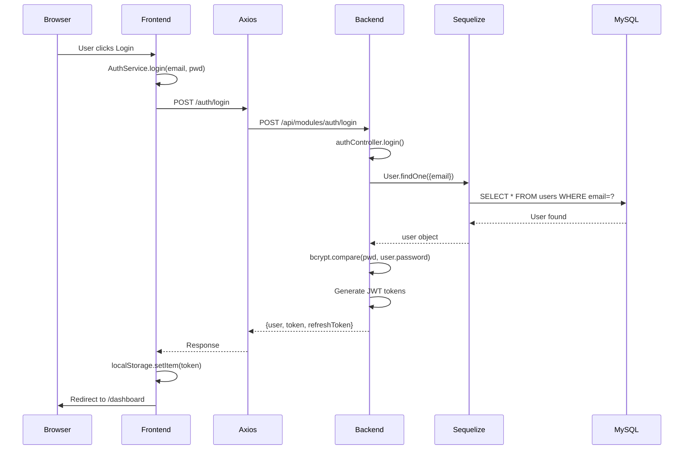

# End-to-End Request Lifecycles

**Last Updated:** November 13, 2025

---

## Overview

This document traces the complete request flow for critical user actions, from UI to database and back.

**Key Convention:**
- `→` = function call / data transformation
- `✓` = success path
- `✗` = error path
- `(FILE:LINE)` = code location

---

## A. Auth: Login → Get Profile

### A1. Login Request

**User Action:** Enter email/password, click "Login"

**Frontend Path:**

1. **UI Component:** `Frontend/src/pages/Auth/Login/index.jsx`
   - User fills email + password
   - Click submit button
   - Call: `AuthService.login(email, password)`

2. **Service Call:** `Frontend/src/api/services/auth.service.js:24–46`
   ```javascript
   async login(identifier, password) {
     const loginPayload = identifier.includes('@')
       ? { email: identifier, password }
       : { username: identifier, password };
     
     const response = await http.post('/auth/login', loginPayload);
     // http intercepts: baseURL = /api/modules
     // Full URL: http://localhost:5000/api/modules/auth/login
     
     const { user, token, refreshToken } = response.data.data;
     localStorage.setItem('token', token);
     localStorage.setItem('refreshToken', refreshToken);
     localStorage.setItem('user', JSON.stringify(user));
     setAuthToken(token);  // Add to http interceptor
     
     return response.data;
   }
   ```

3. **HTTP Client Setup:** `Frontend/src/api/http.js:1–10`
   - Create axios instance with `baseURL = /api/modules`
   - Request interceptor adds: `Authorization: Bearer <token>`

**Backend Path:**

4. **Route Match:** `Backend/src/routes/modules.routes.js:6`
   ```javascript
   router.use('/auth', modules.authRbac.routes);
   // Matches: POST /api/modules/auth/login
   ```

5. **Route Handler:** `Backend/modules/auth-rbac/routes/auth.routes.js:14–17`
   ```javascript
   router.post('/login', authController.login);
   ```

6. **Controller:** `Backend/modules/auth-rbac/controller/auth.controller.js:40–64`
   ```javascript
   async login(req, res) {
     const { username, email, password } = req.body;
     const identifier = username || email;
     
     if (!identifier || !password) {
       return res.status(400).json({ success: false, message: '...' });
     }
     
     const result = await authService.login(identifier, password);
     // ✓ success: return tokens
     // ✗ error (line 63): res.status(401).json({ success: false, ... })
   }
   ```

7. **Service:** `Backend/modules/auth-rbac/service/auth.service.js`
   ```javascript
   async login(identifier, password) {
     // Query User by email or username
     const user = await User.findOne({
       where: {
         [Op.or]: [
           { email: identifier },
           { username: identifier }
         ]
       }
     });
     
     if (!user) throw new Error('User not found');
     
     // Compare password with bcrypt
     const validPassword = await bcrypt.compare(password, user.password);
     if (!validPassword) throw new Error('Invalid password');
     
     // Generate JWT tokens
     const token = jwt.sign(
       { id: user.id, role: user.role },
       process.env.JWT_SECRET,
       { expiresIn: '1h' }
     );
     
     const refreshToken = jwt.sign(
       { id: user.id },
       process.env.JWT_REFRESH_SECRET,
       { expiresIn: '7d' }
     );
     
     return {
       user: { id, username, email, full_name, role },
       token,
       refreshToken
     };
   }
   ```

8. **Database Query:** `Backend/src/models/user.model.js`
   ```sql
   SELECT * FROM users
   WHERE email = ? OR username = ?
   LIMIT 1;
   ```

**Response Flow (Success):**

9. **Controller Response:** `Backend/modules/auth-rbac/controller/auth.controller.js:61`
   ```json
   {
     "success": true,
     "message": "Login successful",
     "data": {
       "user": { "id": 5, "username": "john_doe", "role": "creator" },
       "token": "eyJhbGc...",
       "refreshToken": "eyJhbGc..."
     }
   }
   ```

10. **Frontend Receives:** `Frontend/src/api/services/auth.service.js:44–46`
    - Store token in localStorage
    - Update AuthContext
    - Redirect to dashboard

---

### A2. Get Profile

**User Action:** After login, fetch current user profile

**Frontend Path:**

1. **Component Mount:** `Frontend/src/contexts/AuthContext.jsx`
   ```javascript
   useEffect(() => {
     if (token && !user) {
       AuthService.getProfile().then(response => {
         setUser(response.data.user);
       });
     }
   }, [token]);
   ```

2. **Service Call:** `Frontend/src/api/services/auth.service.js:63–72`
   ```javascript
   async getProfile() {
     const response = await http.get('/auth/profile');
     // Header: Authorization: Bearer <token>
     const user = response.data.data.user;
     localStorage.setItem('user', JSON.stringify(user));
     return response.data;
   }
   ```

**Backend Path:**

3. **Route:** `Backend/modules/auth-rbac/routes/auth.routes.js:31–33`
   ```javascript
   router.get('/profile', authenticate, authController.getProfile);
   ```

4. **Middleware:** `Backend/modules/auth-rbac/middleware/auth.middleware.js:5–29`
   ```javascript
   exports.authenticate = async (req, res, next) => {
     const token = req.headers.authorization?.split(' ')[1];
     if (!token) return res.status(401).json({ success: false, ... });
     
     try {
       const decoded = jwt.verify(token, process.env.JWT_SECRET);
       const user = await User.findByPk(decoded.id);
       if (!user) return res.status(401).json({ success: false, ... });
       
       req.user = user;  // Attach user to request
       next();
     } catch (error) {
       return res.status(401).json({ success: false, message: 'Invalid token' });
     }
   };
   ```

5. **Controller:** `Backend/modules/auth-rbac/controller/auth.controller.js:103–112`
   ```javascript
   async getProfile(req, res) {
     try {
       const profile = await authService.getProfile(req.user.id);
       res.status(200).json({
         success: true,
         data: { user: profile }
       });
     } catch (error) {
       res.status(500).json({ success: false, ... });
     }
   }
   ```

6. **Service:** `Backend/modules/auth-rbac/service/auth.service.js`
   ```javascript
   async getProfile(userId) {
     const user = await User.findByPk(userId);
     return {
       id: user.id,
       username: user.username,
       email: user.email,
       full_name: user.full_name,
       role: user.role,
       created_at: user.created_at
       // password: (never sent)
     };
   }
   ```

---

## B. Templates

### B1. Create Template

**User Action:** Fill template form, click "Create", redirect to question editor

**Frontend Path:**

1. **Component:** `Frontend/src/pages/Templates/TemplateEditor/index.jsx`
   ```javascript
   const handleCreateTemplate = async () => {
     const template = {
       title: formData.title,
       description: formData.description,
       questions: [] // Empty initially
     };
     
     const response = await TemplateService.create(template);
     setTemplateId(response.id);
     // Redirect to question editor with templateId
   };
   ```

2. **Service Call:** `Frontend/src/api/services/template.service.js:66–88`
   ```javascript
   async create(templateData) {
     const response = await http.post('/templates', templateData);
     return {
       ok: response.data.ok,
       id: response.data.id || response.data.data?.template_id,
       template: response.data.data?.template
     };
   }
   ```

**Backend Path:**

3. **Route:** `Backend/modules/templates/routes/template.routes.js:35–37`
   ```javascript
   router.post('/', authenticate, isCreatorOrAdmin, templateController.createTemplate);
   ```

4. **Middleware Check:**
   - `authenticate`: Verify JWT, set req.user
   - `isCreatorOrAdmin`: Check `req.user.role in ['admin', 'creator']`

5. **Controller:** `Backend/modules/templates/controller/template.controller.js:75–107`
   ```javascript
   async createTemplate(req, res) {
     const { title, description, questions } = req.body;
     
     if (!title) {
       return res.status(400).json({
         success: false,
         message: 'Title is required'
       });
     }
     
     const template = await templateService.createTemplate(req.body, req.user);
     res.status(201).json({
       success: true,
       ok: true,
       message: 'Template created successfully',
       id: template.id,
       data: { template, template_id: template.id }
     });
   }
   ```

6. **Service:** `Backend/modules/templates/service/template.service.js:70–104`
   ```javascript
   async createTemplate(templateData, user) {
     const { title, description, questions } = templateData;
     
     // Create template
     const template = await SurveyTemplate.create({
       title,
       description,
       created_by: user.id,
       status: 'draft'
     });
     
     // Create questions if provided
     if (questions?.length > 0) {
       const questionPromises = questions.map((q, index) =>
         Question.create({
           template_id: template.id,
           question_type_id: q.question_type_id,
           question_text: q.question_text,
           required: q.required || false,
           display_order: index + 1
         })
       );
       await Promise.all(questionPromises);
     }
     
     return template;
   }
   ```

7. **Database:**
   ```sql
   INSERT INTO survey_templates (title, description, created_by, status, created_at, updated_at)
   VALUES ('Customer Feedback', '...', 5, 'draft', NOW(), NOW());
   
   -- If questions provided:
   INSERT INTO questions (template_id, question_type_id, question_text, required, display_order)
   VALUES (10, 3, 'How satisfied?', true, 1);
   ```

---

### B2. Add Question with Options

**User Action:** Add new question to template with multiple-choice options

**Frontend Path:**

1. **Component:** `Frontend/src/pages/Templates/TemplateEditor/index.jsx`
   ```javascript
   const handleAddQuestion = async () => {
     const newQuestion = {
       question_text: "How satisfied?",
       question_type_id: 2,  // multiple_choice
       required: true,
       options: [
         { option_text: "Very Satisfied" },
         { option_text: "Satisfied" },
         { option_text: "Neutral" }
       ]
     };
     
     await TemplateService.addQuestion(templateId, newQuestion);
   };
   ```

2. **Service Call:** `Frontend/src/api/services/template.service.js:138–150`
   ```javascript
   async addQuestion(templateId, questionData) {
     const response = await http.post(
       `/templates/${templateId}/questions`,
       questionData
     );
     return response.data;
   }
   ```

**Backend Path:**

3. **Route:** `Backend/modules/templates/routes/template.routes.js:55–57`
   ```javascript
   router.post('/:id/questions', authenticate, isCreatorOrAdmin, templateController.addQuestion);
   ```

4. **Controller:** `Backend/modules/templates/controller/template.controller.js` (addQuestion method)
   ```javascript
   async addQuestion(req, res) {
     const { id: templateId } = req.params;
     const { question_text, question_type_id, required, options } = req.body;
     
     try {
       const result = await templateService.addQuestion(
         templateId,
         { question_text, question_type_id, required, options },
         req.user
       );
       
       res.status(201).json({
         success: true,
         message: 'Question added',
         data: result
       });
     } catch (error) {
       res.status(400).json({ success: false, message: error.message });
     }
   }
   ```

5. **Service:** `Backend/modules/templates/service/template.service.js`
   ```javascript
   async addQuestion(templateId, questionData, user) {
     const { question_text, question_type_id, required, options } = questionData;
     
     // Create question
     const question = await Question.create({
       template_id: templateId,
       question_type_id,
       question_text,
       required: required || false
     });
     
     // Create question options
     if (options?.length > 0) {
       const optionPromises = options.map((opt, index) =>
         QuestionOption.create({
           question_id: question.id,
           option_text: opt.option_text,
           display_order: index + 1
         })
       );
       await Promise.all(optionPromises);
     }
     
     return { question_id: question.id, question };
   }
   ```

6. **Database:**
   ```sql
   INSERT INTO questions (template_id, question_type_id, question_text, required, display_order)
   VALUES (10, 2, 'How satisfied?', true, 2);
   -- question.id = 3
   
   INSERT INTO question_options (question_id, option_text, display_order)
   VALUES
     (3, 'Very Satisfied', 1),
     (3, 'Satisfied', 2),
     (3, 'Neutral', 3);
   ```

---

### B3. Get Template with Questions + Options

**User Action:** Load template editor to view/edit questions

**Frontend Path:**

1. **Component Mount:** `Frontend/src/pages/Templates/TemplateEditor/index.jsx`
   ```javascript
   useEffect(() => {
     TemplateService.getById(templateId).then(result => {
       setTemplate(result.template);
       setQuestions(result.questions);
     });
   }, [templateId]);
   ```

2. **Service Call:** `Frontend/src/api/services/template.service.js:28–46`
   ```javascript
   async getById(id) {
     const response = await http.get(`/templates/${id}`);
     return {
       ok: response.data.ok,
       template: response.data.template,
       questions: response.data.questions || []
     };
   }
   ```

**Backend Path:**

3. **Route:** `Backend/modules/templates/routes/template.routes.js:21–23`
   ```javascript
   router.get('/:id', authenticate, templateController.getTemplateById);
   ```

4. **Controller:** `Backend/modules/templates/controller/template.controller.js:28–71`
   ```javascript
   async getTemplateById(req, res) {
     const { id } = req.params;
     const template = await templateService.getTemplateById(id);
     
     if (!template) {
       return res.status(404).json({ success: false, message: 'Template not found' });
     }
     
     // Normalize questions
     const normalizedQuestions = (template.Questions || []).map(q => ({
       id: q.id,
       label: q.question_text,
       type: q.QuestionType?.type_name,
       required: q.required,
       display_order: q.display_order,
       options: (q.QuestionOptions || []).map(opt => ({
         id: opt.id,
         text: opt.option_text,
         display_order: opt.display_order
       }))
     }));
     
     res.status(200).json({
       success: true,
       ok: true,
       template,
       questions: normalizedQuestions
     });
   }
   ```

5. **Service:** `Backend/modules/templates/service/template.service.js:38–75`
   ```javascript
   async getTemplateById(templateId) {
     const template = await SurveyTemplate.findByPk(templateId, {
       include: [
         {
           model: Question,
           as: 'Questions',
           include: [
             { model: QuestionType, as: 'QuestionType' },
             { model: QuestionOption, as: 'QuestionOptions' }
           ]
         }
       ]
     });
     return template;
   }
   ```

6. **Database (Eager Load):**
   ```sql
   SELECT * FROM survey_templates WHERE id = 10;
   SELECT * FROM questions WHERE template_id = 10;
   SELECT * FROM question_types WHERE id IN (...);
   SELECT * FROM question_options WHERE question_id IN (...);
   ```

---

## C. Surveys

### C1. Create Survey from Template

**User Action:** Select template, fill survey details (title, dates), click "Create"

**Frontend → Backend → DB:**

1. Component: `Frontend/src/pages/Surveys/SurveyEditor/index.jsx`
   ```javascript
   handleCreateSurvey = async () => {
     const survey = {
       template_id: selectedTemplateId,
       title: formData.title,
       start_date: formData.startDate,
       end_date: formData.endDate,
       target_audience: 'all_users'
     };
     const response = await SurveyService.create(survey);
     surveyId = response.data.survey_id;
   };
   ```

2. Service: → `POST /surveys`
   ```javascript
   // Frontend/src/api/services/survey.service.js
   async create(surveyData) {
     return http.post('/surveys', surveyData);
   }
   ```

3. Route: `Backend/modules/surveys/routes/survey.routes.js`
   ```javascript
   router.post('/', authenticate, isCreatorOrAdmin, surveyController.createSurvey);
   ```

4. Controller: `Backend/modules/surveys/controller/survey.controller.js:48–72`
   ```javascript
   const { template_id, title, ... } = req.body;
   if (!template_id || !title) return res.status(400)...
   const survey = await surveyService.createSurvey(req.body, req.user);
   return res.status(201).json({ data: { survey_id, survey } });
   ```

5. Service: `Backend/modules/surveys/service/survey.service.js:97–130`
   ```javascript
   async createSurvey(surveyData, user) {
     const template = await SurveyTemplate.findByPk(template_id);
     if (!template) throw new Error('Template not found');
     
     const survey = await Survey.create({
       template_id,
       title,
       description,
       start_date,
       end_date,
       created_by: user.id,
       status: 'draft'
     });
     
     return survey;
   }
   ```

6. DB:
   ```sql
   INSERT INTO surveys (template_id, title, ..., created_by, status, created_at)
   VALUES (10, 'Q4 Feedback', ..., 5, 'draft', NOW());
   ```

---

### C2. Publish Survey (PATCH Status)

**User Action:** Click "Publish" button on survey editor

**Flow:**

1. Component: `Frontend/src/pages/Surveys/SurveyEditor/index.jsx`
   ```javascript
   await SurveyService.updateStatus(surveyId, 'active');
   ```

2. Service:
   ```javascript
   async updateStatus(id, status) {
     return http.patch(`/surveys/${id}/status`, { status });
   }
   ```

3. Route: `Backend/modules/surveys/routes/survey.routes.js:48–50`
   ```javascript
   router.patch('/:id/status', authenticate, isCreatorOrAdmin, surveyController.updateSurveyStatus);
   ```

4. Controller: `Backend/modules/surveys/controller/survey.controller.js:103–128`
   ```javascript
   async updateSurveyStatus(req, res) {
     const { id } = req.params;
     const { status } = req.body;
     
     if (!['draft', 'active', 'closed', 'analyzed'].includes(status)) {
       return res.status(400).json({ message: 'Invalid status' });
     }
     
     const survey = await surveyService.updateSurveyStatus(id, status, req.user);
     return res.status(200).json({ data: { survey } });
   }
   ```

5. Service: `Backend/modules/surveys/service/survey.service.js:155–180`
   ```javascript
   async updateSurveyStatus(surveyId, newStatus, user) {
     const survey = await Survey.findByPk(surveyId);
     if (!survey) throw new Error('Survey not found');
     
     if (survey.created_by !== user.id && user.role !== 'admin') {
       throw new Error('Access denied');
     }
     
     await survey.update({ status: newStatus });
     return survey;
   }
   ```

6. DB:
   ```sql
   UPDATE surveys SET status = 'active', updated_at = NOW() WHERE id = 25;
   ```

---

### C3. Distribute (Generate Collector Link)

**User Action:** Click "Distribute" tab, click "Generate Public Link"

**Flow:**

1. Component: `Frontend/src/pages/Surveys/Distribute/index.jsx`
   ```javascript
   const handleCreateCollector = async () => {
     const collector = {
       survey_id: surveyId,
       type: 'web_link',
       name: 'Main Link',
       allow_multiple_responses: false
     };
     const response = await CollectorService.create(collector);
     const publicUrl = response.collector.publicUrl;
     setQrCodeUrl(publicUrl);
   };
   ```

2. Service: `Frontend/src/api/services/collector.service.js:16–21`
   ```javascript
   async create(collectorData) {
     const response = await http.post('/collectors', collectorData);
     return response.data.data;
   }
   ```

3. Route: `Backend/modules/collectors/routes/collector.routes.js:8–11`
   ```javascript
   router.post('/', authenticate, isCreatorOrAdmin, collectorController.createCollector);
   ```

4. Controller: `Backend/modules/collectors/controller/collector.controller.js`
   ```javascript
   async createCollector(req, res) {
     const { survey_id, type, name, allow_multiple_responses } = req.body;
     
     const collector = await collectorService.createCollector(
       survey_id,
       { type, name, allow_multiple_responses },
       req.user
     );
     
     return res.status(201).json({
       success: true,
       data: { collector }
     });
   }
   ```

5. Service: `Backend/modules/collectors/service/collector.service.js:54–95`
   ```javascript
   async createCollector(surveyId, collectorData, user) {
     const survey = await Survey.findByPk(surveyId);
     if (!survey) throw new Error('Survey not found');
     
     if (survey.created_by !== user.id && user.role !== 'admin') {
       throw new Error('Access denied');
     }
     
     const token = require('crypto').randomBytes(16).toString('hex');
     // token = 'a1b2c3d4e5f6g7h8i9j0k1l2m3n4o5p6'
     
     const collector = await SurveyCollector.create({
       survey_id: surveyId,
       collector_type: collectorData.type,
       token: token,
       name: collectorData.name,
       is_active: true,
       allow_multiple_responses: collectorData.allow_multiple_responses
     });
     
     return {
       ...collector.toJSON(),
       publicUrl: `${FRONTEND_URL}/public/${token}`
       // 'http://localhost:3000/public/a1b2c3d4e5f6g7h8i9j0k1l2m3n4o5p6'
     };
   }
   ```

6. DB:
   ```sql
   INSERT INTO survey_collectors (survey_id, collector_type, token, name, is_active, created_by, created_at)
   VALUES (25, 'web_link', 'a1b2c3d4e5f6g7h8i9j0k1l2m3n4o5p6', 'Main Link', true, 5, NOW());
   ```

**Response (Frontend Receives):**
```json
{
  "collector": {
    "id": 50,
    "token": "a1b2c3d4e5f6g7h8i9j0k1l2m3n4o5p6",
    "publicUrl": "http://localhost:3000/public/a1b2c3d4e5f6g7h8i9j0k1l2m3n4o5p6",
    "responsesCount": 0
  }
}
```

---

## D. Public Responses

### D1. Fetch Survey by Public Token

**User Action:** Click collector link → loads public survey form

**Frontend Path:**

1. **URL:** `http://localhost:3000/public/a1b2c3d4e5f6g7h8i9j0k1l2m3n4o5p6`

2. **Component Mount:** `Frontend/src/pages/Public/ResponseForm/index.jsx`
   ```javascript
   useEffect(() => {
     const token = params.token;
     ResponseService.getSurveyByToken(token).then(data => {
       setSurvey(data.data.survey);
       setCollectorId(data.data.collector_id);
     });
   }, [token]);
   ```

3. **Service Call:** `Frontend/src/api/services/response.service.js:22–26`
   ```javascript
   async getSurveyByToken(token) {
     const response = await http.get(`/responses/public/${token}`);
     // No JWT needed; public endpoint
     return response.data;
   }
   ```

**Backend Path:**

4. **Route:** `Backend/modules/responses/routes/response.routes.js:13–15`
   ```javascript
   router.get('/public/:token', publicResponsesController.getSurveyByToken);
   // No authenticate middleware
   ```

5. **Controller:** `Backend/modules/responses/controller/public-responses.controller.js:7–62`
   ```javascript
   async getSurveyByToken(req, res) {
     const { token } = req.params;
     
     // Find collector
     const collector = await SurveyCollector.findOne({
       where: { token, is_active: true },
       include: [{
         model: Survey,
         as: 'Survey',
         include: [{
           model: SurveyTemplate,
           as: 'template',
           include: [{
             model: Question,
             as: 'Questions',
             include: [
               { model: QuestionType, as: 'QuestionType' },
               { model: QuestionOption, as: 'QuestionOptions' }
             ]
           }]
         }]
       }]
     });
     
     if (!collector) {
       return res.status(404).json({ ok: false, message: 'Invalid or inactive token' });
     }
     
     if (collector.Survey.status !== 'active') {
       return res.status(400).json({ ok: false, message: 'Survey not active' });
     }
     
     const surveyData = {
       id: collector.Survey.id,
       title: collector.Survey.title,
       questions: collector.Survey.template.Questions.map(q => ({
         id: q.id,
         label: q.question_text,
         type: q.QuestionType.type_name,
         required: q.required,
         options: q.QuestionOptions.map(opt => ({
           id: opt.id,
           text: opt.option_text
         }))
       }))
     };
     
     return res.status(200).json({
       ok: true,
       data: { survey: surveyData, collector_id: collector.id }
     });
   }
   ```

6. **Database (Query):**
   ```sql
   SELECT * FROM survey_collectors WHERE token = 'a1b2c3d4e5f6...' AND is_active = 1;
   -- Eager loads Survey, SurveyTemplate, Questions, QuestionOptions
   ```

---

### D2. POST Submit Public Response

**User Action:** Fill form, click "Submit" (no login required)

**Frontend Path:**

1. **Component:** `Frontend/src/pages/Public/ResponseForm/index.jsx`
   ```javascript
   const handleSubmitResponse = async (answers) => {
     const payload = {
       answers: answers.map(a => ({
         questionId: a.question_id,
         value: a.value,
         optionId: a.option_id  // if multiple-choice
       }))
     };
     
     const response = await ResponseService.submitPublicResponse(token, payload);
     showSuccess('Response submitted!');
   };
   ```

2. **Service Call:** `Frontend/src/api/services/response.service.js:15–18`
   ```javascript
   async submitPublicResponse(token, responseData) {
     const response = await http.post(`/responses/public/${token}`, responseData);
     // No JWT; public endpoint
     return response.data;
   }
   ```

**Backend Path:**

3. **Route:** `Backend/modules/responses/routes/response.routes.js:18–20`
   ```javascript
   router.post('/public/:token', publicResponsesController.submitResponse);
   ```

4. **Controller:** `Backend/modules/responses/controller/public-responses.controller.js:66–181`
   ```javascript
   async submitResponse(req, res) {
     const { token } = req.params;
     const { answers } = req.body;
     
     // Find collector + survey
     const collector = await SurveyCollector.findOne({
       where: { token, is_active: true },
       include: [{ model: Survey, as: 'Survey' }]
     });
     
     if (!collector) {
       return res.status(404).json({ ok: false, message: 'Invalid token' });
     }
     
     if (collector.Survey.status !== 'active') {
       return res.status(400).json({ ok: false, message: 'Survey not active' });
     }
     
     // Create response (anonymous respondent_id = 1)
     const surveyResponse = await SurveyResponse.create({
       survey_id: collector.Survey.id,
       respondent_id: 1,  // Anonymous user
       collector_id: collector.id,
       start_time: new Date(),
       completion_time: new Date(),
       status: 'completed'
     });
     
     // Map and save answers
     // Frontend sends: { questionId, value, optionId (optional) }
     // Backend creates: { question_id, option_id, text_answer, numeric_answer }
     
     const answerPromises = answers.map(async (answer) => {
       const question = await Question.findByPk(answer.questionId);
       
       const answerRow = {
         survey_response_id: surveyResponse.id,
         question_id: answer.questionId
       };
       
       if (answer.optionId) {
         // Multiple-choice selected an option
         answerRow.option_id = answer.optionId;
       } else if (question.question_type_id === RATING_TYPE) {
         // Rating question → numeric_answer
         answerRow.numeric_answer = answer.value;
       } else {
         // Open-ended → text_answer
         answerRow.text_answer = answer.value;
       }
       
       return Answer.create(answerRow);
     });
     
     await Promise.all(answerPromises);
     
     res.status(201).json({
       ok: true,
       message: 'Response submitted successfully',
       data: { response_id: surveyResponse.id }
     });
   }
   ```

5. **Database (Insert):**
   ```sql
   INSERT INTO survey_responses (survey_id, respondent_id, collector_id, start_time, completion_time, status, created_at)
   VALUES (25, 1, 50, NOW(), NOW(), 'completed', NOW());
   -- survey_response.id = 500
   
   INSERT INTO answers (survey_response_id, question_id, option_id, text_answer, numeric_answer, created_at)
   VALUES
     (500, 1, 101, NULL, NULL, NOW()),  -- Option 101 selected
     (500, 2, NULL, 'Great experience', NULL, NOW()),  -- Text answer
     (500, 3, NULL, NULL, 4, NOW());  -- Rating: 4
   ```

---

## E. Results

### E1. Get All Responses for Survey

**User Action:** Survey creator/admin clicks "View Results"

**Frontend Path:**

1. **Component:** `Frontend/src/pages/Surveys/Results/index.jsx`
   ```javascript
   useEffect(() => {
     AnalyticsService.getResponseDetails(surveyId, { page: 1, limit: 20 })
       .then(data => setResponses(data.responses));
   }, [surveyId]);
   ```

2. **Service:** `Frontend/src/api/services/analytics.service.js`
   ```javascript
   async getResponseDetails(surveyId, params) {
     const response = await http.get(`/analytics/survey/${surveyId}/responses`, { params });
     return response.data.data;
   }
   ```

**Backend Path:**

3. **Route:** `Backend/modules/analytics/routes/analytics.routes.js:38–40`
   ```javascript
   router.get('/survey/:survey_id/responses', authenticate, analyticsController.getResponseDetails);
   ```

4. **Middleware:** `authenticate` + implicit owner check in service

5. **Controller:** `Backend/modules/analytics/controller/analytics.controller.js`
   ```javascript
   async getResponseDetails(req, res) {
     const { survey_id } = req.params;
     const { page, limit } = req.query;
     
     const responses = await responseService.getResponsesBySurvey(
       survey_id,
       req.user,
       { page, limit }
     );
     
     res.status(200).json({ success: true, data: responses });
   }
   ```

6. **Service:** `Backend/modules/responses/service/response.service.js:96–159`
   ```javascript
   async getResponsesBySurvey(surveyId, user, options = {}) {
     const { page = 1, limit = 20 } = options;
     const offset = (page - 1) * limit;
     
     const survey = await Survey.findByPk(surveyId);
     if (!survey) throw new Error('Survey not found');
     
     // Access control
     if (survey.created_by !== user.id && user.role !== 'admin') {
       throw new Error('Access denied. Only survey creator can view responses.');
     }
     
     const { count, rows } = await SurveyResponse.findAndCountAll({
       where: { survey_id: surveyId },
       limit,
       offset,
       include: [
         {
           model: User,
           attributes: ['id', 'username', 'full_name']
         },
         {
           model: Answer,
           include: [
             { model: Question, attributes: ['id', 'question_text'] },
             { model: QuestionOption, attributes: ['id', 'option_text'] }
           ]
         }
       ],
       order: [['created_at', 'DESC']]  // Most recent first
     });
     
     return {
       responses: rows.map(r => ({
         id: r.id,
         respondent: r.User,
         submittedAt: r.created_at,
         answers: r.Answers.map(a => ({
           question_id: a.question_id,
           value: a.option_id || a.text_answer || a.numeric_answer
         }))
       })),
       pagination: {
         total: count,
         page,
         limit,
         totalPages: Math.ceil(count / limit)
       }
     };
   }
   ```

7. **Database (Query):**
   ```sql
   SELECT * FROM survey_responses WHERE survey_id = 25 ORDER BY created_at DESC LIMIT 20 OFFSET 0;
   
   -- For each response:
   SELECT * FROM answers WHERE survey_response_id = 500;
   SELECT * FROM questions WHERE id IN (...);
   SELECT * FROM question_options WHERE id IN (...);
   ```

---

## F. Delete Template (with FK Protection)

### F1. Attempt Delete → TEMPLATE_IN_USE Error

**User Action:** Delete template (fails if surveys exist)

**Frontend → Backend:**

1. `await TemplateService.delete(templateId);`

2. `DELETE /api/modules/templates/10` (backend)

3. **Service:** `Backend/modules/templates/service/template.service.js`
   ```javascript
   async deleteTemplate(templateId, user) {
     // Check ownership
     if (template.created_by !== user.id && user.role !== 'admin') {
       throw new Error('Access denied');
     }
     
     // Check for surveys using this template
     const surveyCount = await Survey.count({ where: { template_id: templateId } });
     if (surveyCount > 0) {
       throw new Error('TEMPLATE_IN_USE: Cannot delete template with active surveys');
     }
     
     // Cascade delete: Questions → QuestionOptions
     await Question.destroy({ where: { template_id: templateId } });
     await SurveyTemplate.destroy({ where: { id: templateId } });
   }
   ```

4. **Response (400 Bad Request):**
   ```json
   {
     "success": false,
     "message": "TEMPLATE_IN_USE: Cannot delete template with active surveys"
   }
   ```

### F2. Suggest Archive

**Frontend Flow:**
```javascript
if (error.message.includes('TEMPLATE_IN_USE')) {
  showModal({
    title: 'Template in Use',
    message: 'Archive template instead of deleting?',
    onConfirm: () => TemplateService.archive(templateId)
  });
}
```

**Backend Archive (PATCH /templates/:id/archive):**
```javascript
async archiveTemplate(templateId, user) {
  await SurveyTemplate.update(
    { is_archived: 1, status: 'archived' },
    { where: { id: templateId } }
  );
}
```

---

## Summary Diagram (Mermaid)



---

**End of End-to-End Request Lifecycles**
