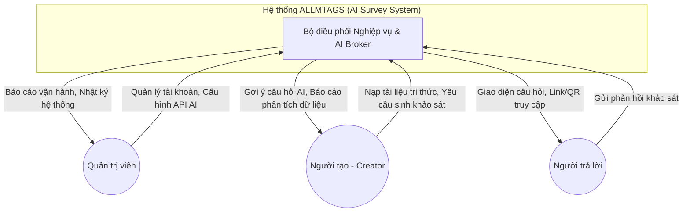

# CHƯƠNG 1. NGHIÊN CỨU VÀ PHÂN TÍCH HỆ THỐNG

## 1.1. Hệ thống ứng dụng ALLMTAGS

### 1.1.1. Tổng quan hệ thống (System Overview)

#### 1.1.1.1. Ngữ cảnh hệ thống (System Context)

Hệ thống ALLMTAGS (AI-Powered Survey Generation System) là giải pháp tự động hóa quy trình xây dựng biểu mẫu khảo sát dựa trên công nghệ RAG (Retrieval-Augmented Generation). Hệ thống cho phép người dùng nạp dữ liệu từ tài liệu cá nhân để AI sinh ra các bộ câu hỏi chuyên sâu và chính xác.

**Hình ảnh 1: Sơ đồ Ngữ cảnh Hệ thống (System Context Diagram)**

**Admin → Hệ thống:**
Admin là người có quyền quản trị cao nhất, chịu trách nhiệm cấu hình tổng thể hệ thống, bao gồm quản lý thông tin người dùng, phân quyền truy cập và thiết lập các tham số hoạt động cho các mô hình AI (Gemini API Key). Admin thực hiện giám sát hiệu suất hệ thống, cấu hình danh mục kiến thức chung và quản lý bảo mật dữ liệu.

**Hệ thống → Admin:**
Hệ thống cung cấp giao diện quản trị trực quan để theo dõi trạng thái các dịch vụ. Đồng thời, hệ thống ghi nhận lịch sử thao tác, thông báo lỗi kết nối API, hiển thị biểu đồ lưu lượng sử dụng và cho phép trích xuất báo cáo quản trị về hoạt động của các Creator trên hệ thống.

**Người tạo (Creator) → Hệ thống:**
Creator là đối tượng sử dụng chính, thực hiện nạp dữ liệu (PDF, URL, YouTube) vào "Personal Notebook" để xây dựng cơ sở tri thức. Creator nhập yêu cầu (Prompt) để AI trích xuất thông tin và sinh câu hỏi. Họ thực hiện chỉnh sửa, thiết kế khảo sát và xem báo cáo phân tích AI sau khi thu thập phản hồi.

**Hệ thống → Người tạo (Creator):**
Hệ thống cung cấp công cụ nạp dữ liệu và quản lý tri thức thông minh. Sau khi xử lý RAG, hệ thống trả về các bản thảo câu hỏi khảo sát kèm theo chỉ số tin cậy (Fidelity Score). Hệ thống cũng cung cấp các module phân tích bằng AI để tóm tắt ý kiến và biểu đồ hóa kết quả phản hồi.

**Người trả lời → Hệ thống:**
Người trả lời tiếp nhận khảo sát qua link hoặc mã QR. Họ thực hiện nhập nội dung trả lời vào các trường dữ liệu. Hệ thống đảm bảo tính minh bạch bằng cách ghi lại nhật ký phản hồi và gửi thông báo xác nhận hoàn thành khảo sát cho người dùng.

**Hệ thống → Người trả lời:**
Hệ thống hiển thị giao diện khảo sát tương thích đa thiết bị (Responsive). Sau khi nhận phản hồi, hệ thống gửi thông báo trạng thái thành công và lưu trữ dữ liệu an toàn vào cơ sở dữ liệu để Creator xử lý.

#### 1.1.1.2. Chức năng sản phẩm (Product features)

**1. Quản lý tài khoản và phân quyền (Account & Permission Management)**
*   Đăng nhập/đăng xuất, đổi mật khẩu và xác thực qua Google.
*   Quản lý danh sách người dùng và phân cấp 3 vai trò: Admin, Creator, Người trả lời.
*   Thiết lập quyền cộng tác trên từng Workspace.

**2. Quản lý tri thức và Notebook (Knowledge Management)**
*   Tạo và quản lý các Workspace riêng biệt.
*   Nạp tri thức đa nguồn: Tệp tin (PDF, TXT), Trang web (URL) và Video (YouTube).
*   Theo dõi trạng thái vector hóa dữ liệu (Ingestion Status).

**3. Tự động sinh khảo sát bằng AI (AI-Powered Generation)**
*   Sử dụng công nghệ RAG để sinh câu hỏi bám sát tài liệu nguồn (Strict Grounding).
*   Tùy chỉnh vai diễn AI (Consultant, Examiner) và độ khó của khảo sát.
*   Tính toán độ tương đồng và gán nhãn danh mục tự động.

**4. Biên tập và Thiết kế khảo sát (Survey Design)**
*   Trình soạn thảo câu hỏi hỗ trợ nhiều loại: Trắc nghiệm, Tự luận, Rating.
*   Kéo thả thay đổi thứ tự câu hỏi và thiết lập ràng buộc bắt buộc (Mandatory).
*   Tùy chỉnh giao diện hiển thị và preview khảo sát.

**5. Phát hành và Thu thập (Collection)**
*   Phát hành khảo sát qua link rút gọn và mã QR định danh.
*   Hệ thống chống trả lời trùng lặp và bảo mật thông tin người phản hồi.

**6. AI Analytics & Reporting**
*   Tự động phân tích ý nghĩa các câu trả lời văn bản bằng AI.
*   Trực quan hóa dữ liệu bằng biểu đồ (Chart.js) và xuất báo cáo PDF/Excel.

**7. Thông báo và Theo dõi (Real-time Notifications)**
*   Thông báo qua Socket.io khi có phản hồi mới hoặc hoàn tất nạp dữ liệu.
*   Truy xuất lịch sử thao tác và tiến độ thu thập dữ liệu theo thời gian thực.

#### 1.1.1.3. Công nghệ sử dụng (Technologies Used)
*   **Cơ sở dữ liệu:** MySQL 8.0 (Relational), ChromaDB (Vector Search).
*   **Ngôn ngữ:** JavaScript (Node.js), Python 3.10+, React.
*   **Framework:** Express (Backend), FastAPI (AI Engine), React 18 (Frontend).
*   **AI Engine:** Google Gemini 1.5 Flash, all-MiniLM-L6-v2 (Embedding).
*   **IDE:** Visual Studio Code.

### 1.1.2. Kiến trúc hệ thống (System Architect)

#### 1.1.2.1. Design Pattern

Hệ thống được thiết kế theo mô hình kiến trúc phân tầng (Layered Architecture) với sự tách biệt rõ ràng giữa các lớp:

*   **UI (User Interface):**
    *   Quản lý giao diện bằng React. Mỗi module có CSS riêng để đảm bảo tính đóng gói.
    *   Sử dụng Component-based architecture để tái sử dụng các thành phần giao diện.
*   **Application Model (Mô hình ứng dụng):**
    *   Mô hình được điều phối tại runtime bởi Node.js Server.
    *   Sử dụng Socket.io để duy trì kết nối hai chiều, cập nhật dữ liệu realtime mà không cần reload.
*   **Behavior (Hành vi):**
    *   **AI Broker (Python FastAPI):** Xử lý luồng RAG, tìm kiếm vector và giao tiếp với Gemini API.
    *   **Controller Layer (Node.js Express):** Xử lý logic nghiệp vụ, xác thực JWT và điều phối luồng dữ liệu.
    *   **Business Library:** Sử dụng Sequelize ORM để trừu tượng hóa các thao tác database và Axios cho giao tiếp nội bộ.
*   **Storage (Lưu trữ):**
    *   **Business Classes:** Định nghĩa các thực thể như User, Survey, Workspace, Response.
    *   **Vector DB:** Lưu trữ dữ liệu tri thức dưới dạng vector toán học (Embeddings).
    *   **Relational DB:** Lưu trữ dữ liệu nghiệp vụ có cấu trúc và lịch sử hệ thống.

#### 1.1.2.2. Luồng dữ liệu nội bộ (Internal Data Flow)

Hệ thống vận hành thông qua sự phối hợp chặt chẽ giữa Node.js và Python:
*   **Node.js → Python:** Gửi yêu cầu sinh câu hỏi kèm theo từ khóa, số lượng câu hỏi và Workspace ID.
*   **Python → AI:** Thực hiện tìm kiếm ngữ nghĩa trên ChromaDB, sau đó hợp nhất dữ liệu vào Prompt gửi tới Gemini.
*   **AI → Python → Node.js:** Trả về kết quả JSON đã được chuẩn hóa để Node.js lưu vào MySQL và hiển thị lên giao diện.